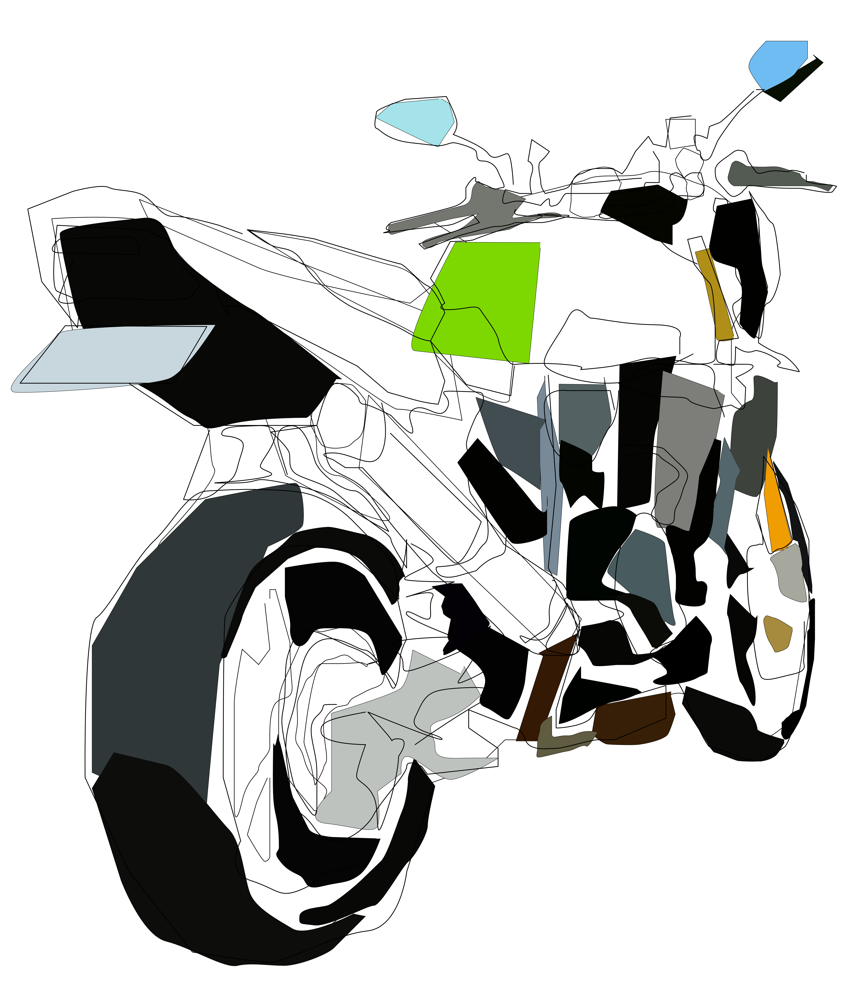
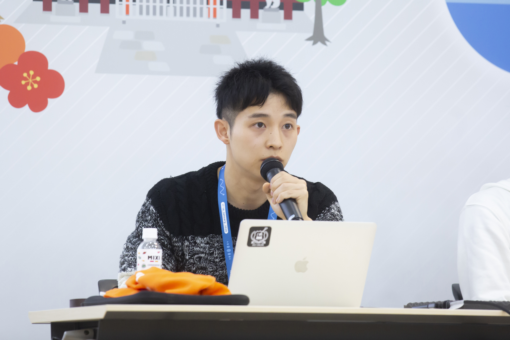

# Who am I?
- Yusho Yamaguchi
- Master's student at the Osaka University

<small>(JANOG53ミーティング フォトアルバムより)</small>

# Interest
- System Software (OS, virtualization, etc.)
- Networking (BGP, SRv6, etc.)
    - My master's research topic is route verification technology in BGP.

# GitHub
- [GitHub](https://github.com/yushoyamaguchi)

# Blog(Japanese)
- [はてなブログ](https://yama-vanvan.hatenablog.com)
- [Qiita](https://qiita.com/yama_vanvan)

# Publications
- [IA研究会 2023](https://ken.ieice.org/ken/paper/20231122RCYm/)
- [Internship 2023](https://engineers.ntt.com/entry/2023/03/16/075605)